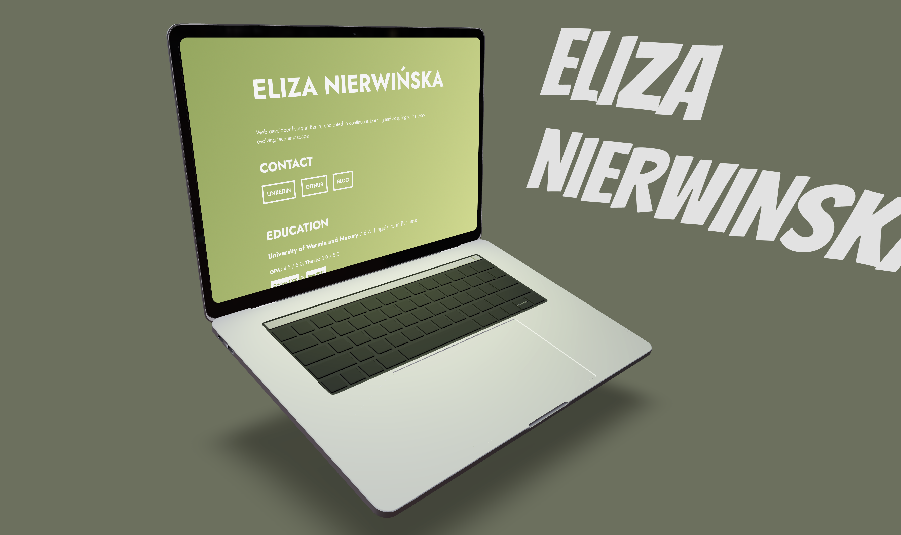

<h1 align="center">
<br>
Portfolio
<br>
</h1>
<h4 align="center">Made with Three.js and R3F</h4>



## Run the App
**Clone the repository**:
```sh
git clone https://github.com/elizanierwinska/Portfolio-site-Three.js.git
```

**Install all the dependencies:**<br>
npm
```sh
npm install 
```
yarn
```sh
yarn install
```
pnpm
```sh
pnpm install
```

**In the project directory run**: 
```sh
npm run dev
```

This will run the application in the development mode.


## Information about the project

Portfolio Site with Three.js is a web-based portfolio showcasing project, leveraging the power of Three.js for 3D rendering and visualization.

### Features
* **Interactive 3D desigb**: The centerpiece of this portfolio site is its interactive 3D layout, allowing visitors to explore the project from different angles. Visitor might change the position of the laptop with the coursor.
* **Zoom in**: By hovering over the laptop visitor is able to zoom in.
* **Scroll**: Visitor can freely scroll down the page displayed on the laptop monitor.

## This project was built with:
* React Three Fiber (R3F)
* Three.js
